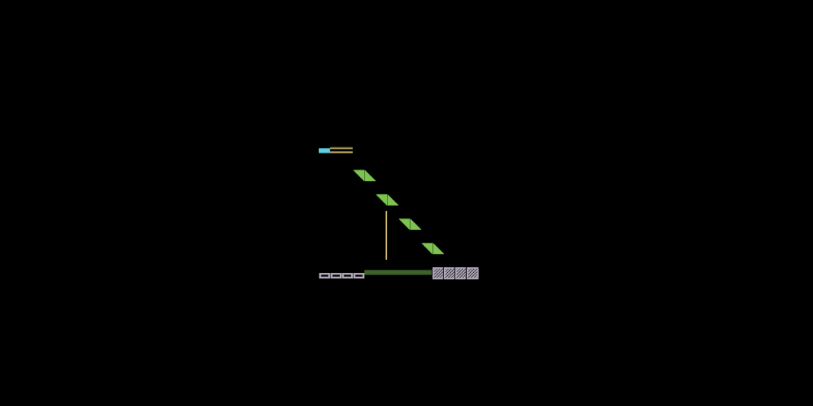

# ccodoc

ccodoc（鹿威し）simulated（造）in your terminal（庭）

  

## options

- `--wabi`

    Render ccodoc alone. (default)

    Unsatisfied does not always mean not-satisfied. Absent does not always mean not-present.

    It is just what it is.（侘び）

- `--sabi HH:mm`

    Render ccodoc with the timer set for this duration.

    Impermanent does not always mean not-permanent. Behind does not always mean not-ahead.

    It will be just what it will be.（寂び）

- `--satori`

    Remove all ornaments.

    Neither color nor sound is needed as they already lie within you.（悟り）

- `--sound-tsutsu-drip file`

    Play this sound when water drips from kakehi（筧）into tsutsu（筒）.

- `--sound-tsutsu-bump file`

    Play this sound when tsutsu（筒）bumps.

- `--sound-uguisu-call file`

    Play this sound when uguisu（鶯）calls.

    Uguisu calls when the timer expires in sabi mode, etc.

## license

- [MIT License](./LICENSE)

    things unless otherwise stated

- [CC0 1.0](https://creativecommons.org/publicdomain/zero/1.0/deed.en)
  - assets/sound/tsutsu_drip.mp3

- [ＮＨＫクリエイティブ･ライブラリー](https://www.nhk.or.jp/archives/creative/rule.html) by NHK
  - assets/sound/tsutsu_bump.mp3
  - assets/sound/uguisu_call.mp3
